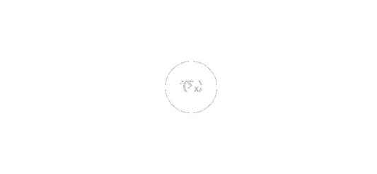
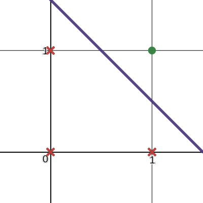
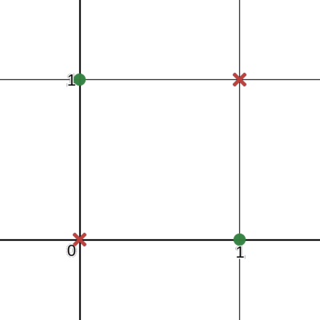
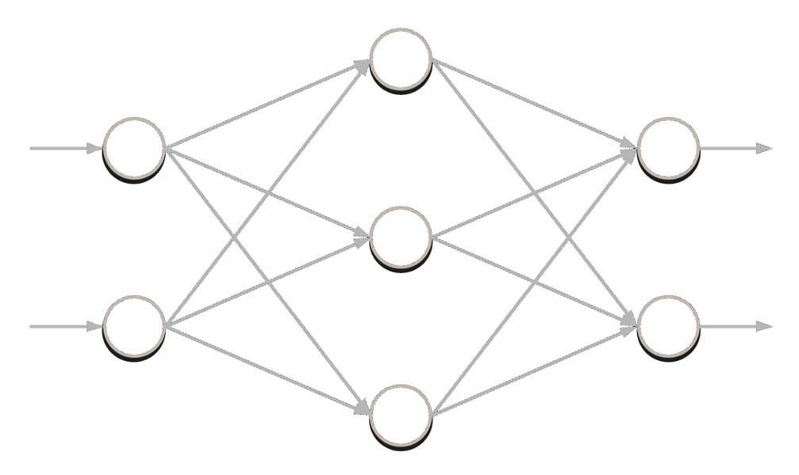
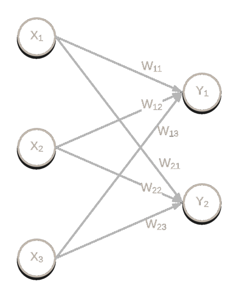
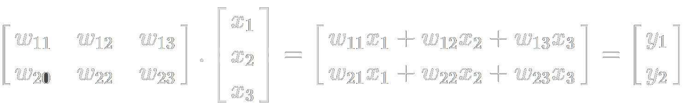

*Credit to 3Blue1Brown for amazing visualizations like this (Without the JS logo)*

Ever since I first learned about neural networks, I have always wanted to learn how to develop and use them. At that time I was pretty intimidated and overwhelmed by the utilities available for neural networks and deep learning.

After watching the _very_ educational [3Blue1Brown](https://www.youtube.com/channel/UCYO_jab_esuFRV4b17AJtAw) and [The Coding Train](https://www.youtube.com/channel/UCvjgXvBlbQiydffZU7m1_aw) YouTube videos on neural networks, I got some inspiration to buckle down and finally write a neural network. So now I want to share what I did, how I did it, and what my overall experience was.

This post will be broken down into a few sections. First some background on what exactly a neural network is, then an overview of what I produced, and finally how I did it.

> _Note that this implementation is not supposed to be optimized in any way, it's intent is to be easily understandable and to help others and myself understand how neural networks work. I am by no means a JavaScript guru (one of the reasons I decided to do this in Javascript is so that I could get better at it), so if there is some way I could improve the code to make it more understandable/readable, please let me know!_

## So what exactly _is_ a neural network?

> If you don't know what a neural network is, [this playlist](https://www.youtube.com/playlist?list=PLZHQObOWTQDNU6R1_67000Dx_ZCJB-3pi) is one of the most helpful resources out there for understanding them. If anything I explain doesn't make sense, it's likely explained better there.

First, I'll explain what a perceptron is. A perceptron represents a weighted sum of inputs (and optionally a bias) sent through an activation function. A perceptron can be pictured like this.

*A single perceptron*

Each input to the perceptron has a weight. Those weights get multiplied by their inputs, and the perceptron sums the results. The perceptron then passes that sum into an activation function, which is usually a sigmoid function, to compute the perceptrons output. Using a perceptron, you can train/learn the weights of the inputs to solve any _linearly separable_ problem.

### Linearly separable?

By linearly separable, I mean that the problem space can be divided up by a line. Let's say we're solving the AND problem:

- `0 AND 0`, `0 AND 1`, and `1 AND 0` are false (or 0)
- `1 AND 1` is true (or 1)

Our dataset looks like this:

| A | B | A AND B |
| - | - | ------- |
| 0 | 0 |    0    |
| 0 | 1 |    0    |
| 1 | 0 |    0    |
| 1 | 1 |    1    |

Our problem space would look like this:



As you can see, we can very clearly draw a line to separate the problem space, which means this problem is linearly separable. An example of a problem that is not is the XOR problem.

- `0 XOR 0` and `1 XOR 1` are false (or 0)
- `0 XOR 1` and `1 XOR 0` are true (or 1)

So our dataset for the XOR problem looks like this:

| A | B | A XOR B |
| - | - | ------- |
| 0 | 0 |    0    |
| 0 | 1 |    1    |
| 1 | 0 |    1    |
| 1 | 1 |    0    |

Which if plotted:



makes it clear that this problem is not linearly separable. To solve this problem, we're going to need to chain perceptrons together.

### MultiLayer Perceptrons

When you connect multiple perceptrons together, you get a multilayer-perceptron (MLP), which is a type of neural network. These nodes (perceptrons) are connected together in layers, where each node in one layer connects to each node in the next layer, like shown below.

*A multilayer perceptron*

Most often there will be a bias with each layer of a neural network. The bias is just another node connected to the other nodes in that layer, whose activation (the value that node outputs) is always 1. You can architect your neural network, or model, to have as many nodes in each layer as you want, however more nodes isn't always better. To make predictions, you feed your inputs into the input layer and the activations of the output layer will be your model's predicted result.

Training multilayer perceptrons can be pretty tricky. The values of each of those weights and biases determine what the model does. You could have the same model but with different weights and biases, and the model could perform two different things. When training, you want to find the right values for each of those weights and biases that make the model correctly solve the problem at hand. Adjusting those weights and biases requires high-dimensional calculus (to figure out how to adjust those weights and biases to minimize error) and a lot of computational resources.

## What I did

Now that we understand what a neural network is, lets go over what I made. You can find all of the code [here](https://github.com/mbarneyjr/multilayerperceptron-js). So I made a mini "library," and to show you how it's used, we'll solve the XOR problem with it!

First lets gather the data into a javascript object. We need to make sure the labels line up with the data.

> _Note that it's very unlikely, for most problems, that you'll have the entire problem domain in your dataset like we do here. Often times you'll split your gathered data into two datasets: one for training and one for evaluating your model's performance on data it hasn't been trained on._

``` javascript
let dataset = {
  inputs: [
    [0, 0],
    [0, 1],
    [1, 0],
    [1, 1]
  ],
  targets: [
    [0],
    [1],
    [1],
    [0]
  ]
};
```

Now lets create the network. We need to:

- import the library

``` javascript
const { MultiLayerPerceptron, ActivationFunction } = require('./source/multilayer-perceptron');
```

- create the activation function for the network's nodes (passing the function itself and the derivative of the function)

``` javascript
let sigmoid = new ActivationFunction(
  x => 1 / (1 + Math.exp(-x)), // sigmoid
  y => y * (1 - y) // derivative of sigmoid
);
```

- create a multilayer perceptron object, passing the input dimensions
- add a few layers, passing how many nodes and the activation function for each layer
- randomize the weights for training (to avoid symmetry in training)

``` javascript
let mlp = new MultiLayerPerceptron({inputDimension: 2})
  .addLayer({nodes: 2, activation: sigmoid})
  .addLayer({nodes: 2, activation: sigmoid})
  .addLayer({nodes: 1, activation: sigmoid})
  .randomizeWeights();
```

- train the neural network, passing the train dataset and labels, validation dataset and labels, the number of epochs to train for, the learning rate, and the training options

``` javascript
mlp.train({
  trainData: dataset.inputs,
  trainLabels: dataset.targets,
  validationData: dataset.inputs,
  validationLabels: dataset.targets,
  numEpochs: 100000,
  learningRate: 0.1,
  verbose: true
});
```

Our dataset contains all of the possible inputs to the XOR problem, so we will use our dataset as both the train and validation data. When I train the network, I'll see something like this, if I set `verbose` to true:

``` bash
Epoch 10; Error 1.9860974914165456
...
Epoch 100; Error 0.76609707552872275
...
Epoch 1000; Error 0.166096867598113085
...
Epoch 5000; Error 0.036096035894226
...
Epoch 10000; Error 0.03609582796927307
...
```

As you can see, the error decreased a lot (the predicted values are got closer to the target values), which means that this network got more accurate when making predictions on the validation data. Now we can make predictions with our model:

``` javascript
console.log(mlp.predict([0, 0]).prediction); // [0.02039202706589195]
console.log(mlp.predict([0, 1]).prediction); // [0.9848467111547554]
console.log(mlp.predict([1, 0]).prediction); // [0.9850631024542238]
console.log(mlp.predict([1, 1]).prediction); // [0.013544196415469074]
```

Both `0.02039202706589195` and `0.013544196415469074` are pretty close to zero, and both `0.9848467111547554` and `0.9850631024542238` are pretty close to one. We can interpret anything above a 0.9 as a 1 and anything below a 0.1 as a 0, so we can conclude that the model is making accurate predictions.

## Alright, so how did I do it?

Here comes some linear algebra. It's important to understand that the weights of a neural network can be represented as a Matrix, and that the activations of any given layer can be calculated with the dot product of the activations of the previous layer with the weights connecting them to the current layer, like this:

<center></center>

<center>⬇⬇⬇</center>

<center></center>

So a neural network can be represented as a series of matrices in which you compute the dot product of to calculate an output.

Understanding this, I created a simple matrix library. Sure, I could have loaded in an already-existing Javascript math library, but I feel that I'm able to get a much better idea of how neural networks work if I write it out myself. This library includes a `Matrix` class that lets you do various matrix operations, such as the Hadamard (element-wise) product, dot product, element-wise addition/subtraction, a map function, and even a randomize function. With this library, I can write my own neural network.

### Laying the foundation

Let's think about what we're going to need. We will have a `MultiLayerPerceptron` class. With that class, we want to be able to add as many layers as we want, randomize the weights and biases,  make predictions, and most importantly, train the network.

``` javascript
class MultiLayerPerceptron {
  constructor() {}

  addLayer() {}

  randomizeWeights() {}

  predict() {}

  trainIteration() {}

  train() {}

  // other "fluff"
}
```

Let's get the constructor made first. We'll need to give the object an array for the weights and biases, and another one to store the activation functions, and we'll need to keep track of the input dimension.

``` javascript
constructor(options) {
  this.weightArray = [];
  this.biasArray = [];
  this.activationFunctions = [];
  this.inputDimension = options.inputDimension;
}
```

When we add a layer, we'll need to keep track of the number of nodes that layer will have and the activation function that layer will use. The same index in each of those arrays will represent a layer. If we are adding the first non-input layer, we'll have to use the input dimension as the number of columns for the weight matrix, otherwise we can reference the number of rows in the weight matrix of the previous layer.

``` javascript
addLayer(layer) {
  let weights;
  // if this is the first layer being added, use the input dimension
  if (this.weightArray.length === 0) {
    weights = new Matrix(layer.nodes, this.inputDimension);
  } else {
    weights = new Matrix(layer.nodes, this.weightArray[this.weightArray.length - 1].rows);
  }
  let biases = new Matrix(layer.nodes, 1);
  this.weightArray.push(weights);
  this.biasArray.push(biases);
  this.activationFunctions.push(layer.activation);
}
```

Now we'll want to be able to randomize the weights, which will be very useful for training. We'll just randomize between -1 and 1.

``` javascript
randomizeWeights() {
  this.weightArray.forEach(weights => weights.randomize(-1, 1));
  this.biasArray.forEach(bias => bias.randomize(-1, 1));
}
```

### Matrix Multiplication and Weighted Sums

Lets implement a way to make predictions with our model. This one is kinda tricky but not too bad, it's where a lot of the matrix operations come into play. We understand that a neural network is a series of weighted sums, so we're going to start with our sum equal to our input values. Then we're going to dot product the current layer's weights by the input, and continue to dot product our way through each layer until we reach the end, and our sum will be the activations of the output layer. We may want to keep track of the state of each of those hidden layers (especially for training purposes), so we'll also return that too.

``` javascript
predict(inputArray) {
  let input = Matrix.fromArray(inputArray);
  if (this.weightArray[0].columns !== input.rows) {
    throw Error('Prediction input does not fit in the network');
  }

  let sum = input;
  let activations = [];
  for (let i = 0; i < this.weightArray.length; i++) {
    // figure out the next layer's node values
    sum = Matrix.dot(this.weightArray[i], sum);
    sum.add(this.biasArray[i]);
    activations.push(sum);
    // run those values through the activation function
    sum.map(this.activationFunctions[i].function);
  }
  return {
    prediction: sum.toArray(),
    activations: activations
  }
}
```

### Back Propagation and Gradient Descent

Now here's the difficult part: back propagation. The concept of backpropagation itself isn't very complicated, however the calculus behind it can be difficult to wrap your head around (I mean, it's super difficult to imagine a more-than-5-dimensional space). The 3Blue1Brown videos came in very handy when I was working on this part, so I'd _highly_ recommend you watch them.

But as an overview of what this is doing, we work backwards through the network, starting off by calculating the error of our network. That is, the difference between the target values that we were expecting and the actual predicted values. With those errors, we calculate the gradients (refer to the 3Blue1Brown videos). With those gradients and the transposed weight matrix of the previous layer, we can calculate how much we need to alter the current layer's weights (multiplied by a learning rate). How much to alter the current layer's biases is determined by the gradients directly. Once that's done, we calculate the next layer's activation errors through a dot product of the current weight matrix transpose and the current errors. We then repeat until we've reached the input layer of the network.

_I know that's a lot to understand and wrap your head around, it took me a while, but I mean it when I say the 3Blue1Brown videos helped me a lot. I encourage you to check them out, you'll definitely learn something new!_

``` javascript
trainIteration(input, target, learningRate) {
  // first make a forward-pass through the network
  let { prediction, activations } = this.predict(input, target);
  let gradients, weightDeltas, previousTransposed;
  let targets = Matrix.fromArray(target);
  let layerOutputs = Matrix.fromArray(prediction);
  // get the output layer's errors
  let layerErrors = Matrix.subtract(targets, layerOutputs);
  // then for each layer, going backwards:
  for (let i = this.weightArray.length - 1; i > 0 ; i--) {
    // calculate the gradient (multiply by learning rate)
    gradients = Matrix.map(layerOutputs, this.activationFunctions[i].derivative)
      .multiply(layerErrors)
      .multiply(learningRate)
    // calculate the values to adjust the weights by
    previousTransposed = Matrix.transpose(activations[i-1]);
    weightDeltas = Matrix.dot(gradients, previousTransposed);
    // update the weights and biases to be more accurate
    this.weightArray[i].add(weightDeltas);
    this.biasArray[i].add(gradients);
    // then calculate next (previous since we're working backwards) layer's errors
    layerOutputs = activations[i-1];
    layerErrors = Matrix.dot(Matrix.transpose(this.weightArray[i]), layerErrors);
  }
}
```

Now that function only trains the network for one element in your dataset, adjusting the weights one time. For each item in your dataset (an epoch), you'll want to run this function with it. During each epoch, you'll want to randomize the order that your dataset gets fed into the network for training so that your net. You'll also want to supply a validation dataset apart from your train dataset that is used to evaluate the network's accuracy after each epoch. I've also implemented a way to toggle whether or not to evaluate and report on the network as it's being trained.

``` javascript
train(options) {
  // for each epoch:
  for (let epoch = 1; epoch <= options.numEpochs; epoch++) {
    // for each item in a shuffled train dataset
    [...Array(options.trainData.length).keys()].sort(() => 0.5 - Math.random()).forEach(dataElement => {
      // adjust the weights to be more accurate for that item
      this.trainIteration(options.trainData[dataElement], options.trainLabels[dataElement], options.learningRate);
    })
    // after the epoch, if enabled evaluate the model with the validation dataset
    if (options.verbose)
      console.log(`Epoch ${epoch}; Error ${this.evaluate(options.validationData, options.validationLabels)}`);
  }
}
```

Now you have successfully written your own neural network! Hopefully through doing this, you have a much better idea of how neural networks work, and can go out and learn higher level libraries like Keras or even Tensorflow, and not just understand how to use them, but what is going on behind the scenes.

## Acknowledgements

This project was inspried greatly from [The Coding Train](https://www.youtube.com/channel/UCvjgXvBlbQiydffZU7m1_aw). A lot of the code itself is based on his implementation; this implementation mainly extends the functionality of his library.

A lot of my time spent researching ultimately led to me watching the [3Blue1Brown](https://www.youtube.com/channel/UCYO_jab_esuFRV4b17AJtAw) videos, I 110% recommend that anyone who is the slightest bit curious watch those videos.

Thank you for reading! If you have any questions or comments, let me know! I'm always open to feedback!
